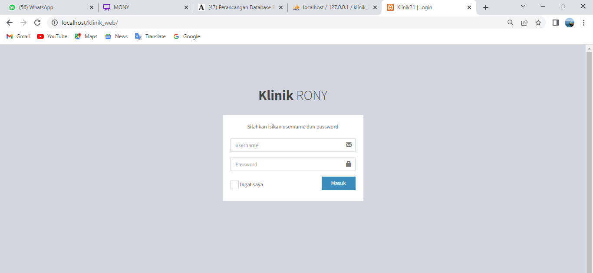
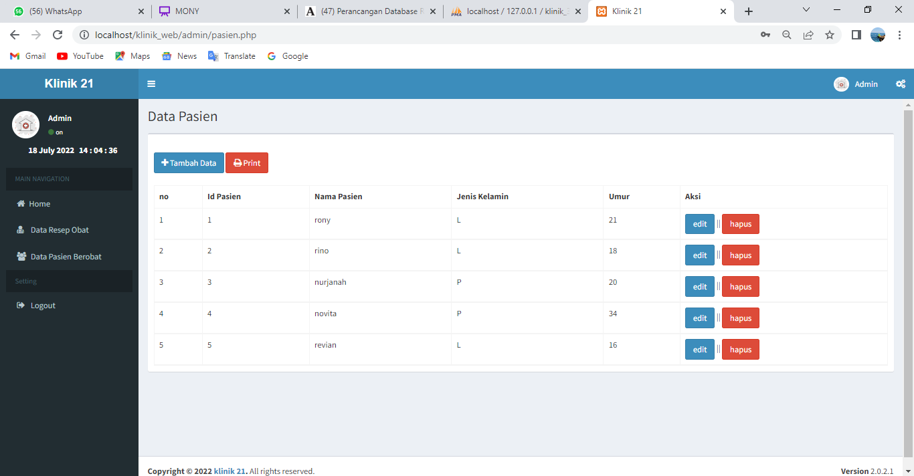
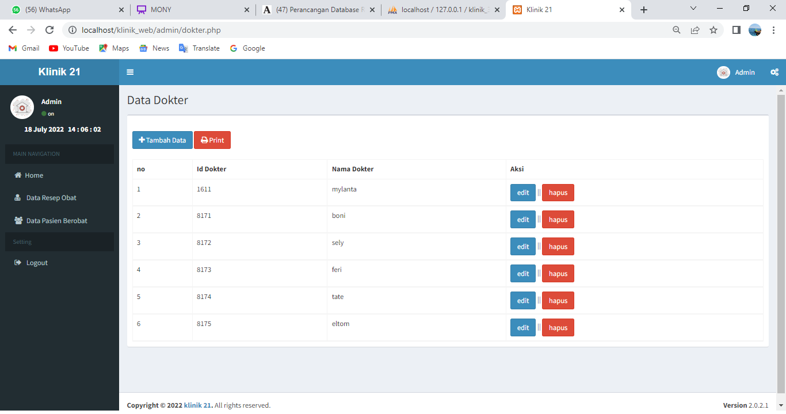
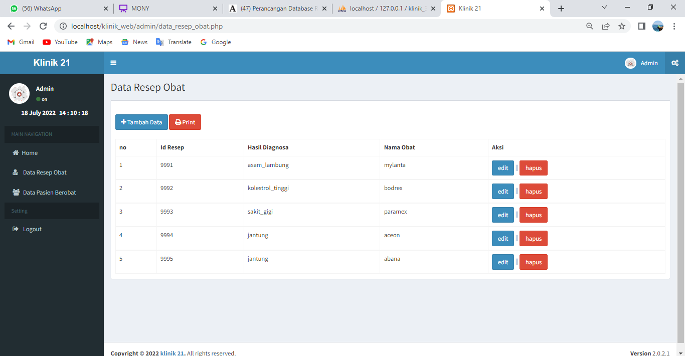
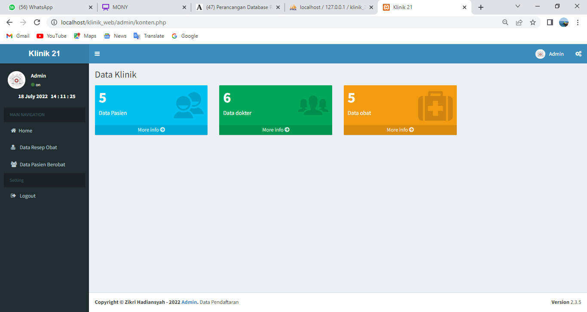

# uas_SBD
## UJIAN AKHIR SEMESTER

Nama : RONY ELTOM ATIBAMAN

NIM : 312010003

Kelas : TI.20.D.1

Matkul : Sistem Basis Data

Dosen : Muhammad Najamuddin Dwi Miharja, S.Kom, M.kom

# Membuat Sistem Informasi Klinik.

* tampilan login

* tampilan daa pasien

* tapilan data dokter

* tampilan data obat

* Implementasi Fungsi.
Mengimplementasikan Fungsi untuk menampilkan total data :

CREATE FUNCTION fn_totalUsers() RETURNS INT(11) UNSIGNED NOT DETERMINISTIC NO SQL SQL SECURITY DEFINER RETURN (SELECT COUNT(id_pasien) FROM pasien)
